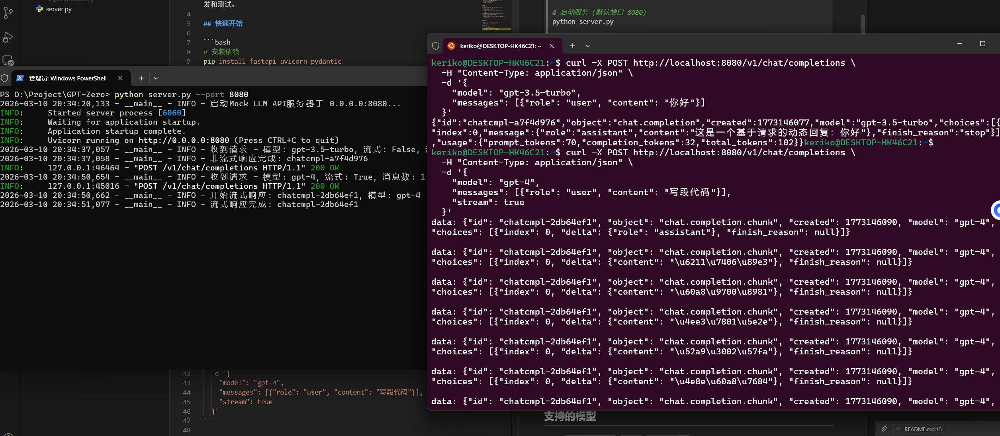
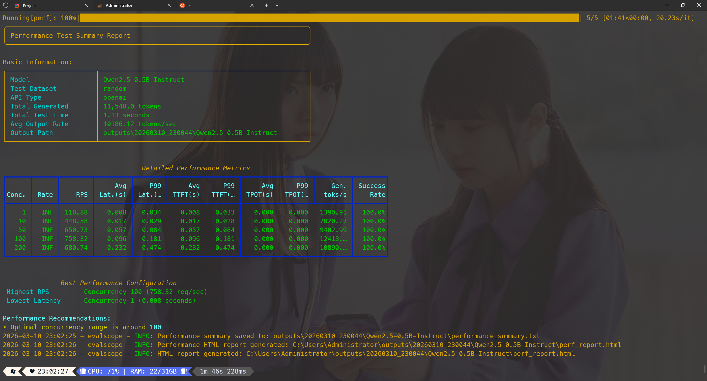

# Mock LLM API Server

基于 FastAPI 的轻量级 LLM API 模拟服务器，兼容 OpenAI API 格式，用于本地开发和测试。

## 快速开始

```bash
# 安装依赖
pip install fastapi uvicorn

# 启动服务 (默认端口 8080)
python server.py

# 指定端口
python server.py --port 9090
python server.py -p 9090 --host 127.0.0.1
```

## API 端点

| 端点 | 方法 | 说明 |
|------|------|------|
| `/v1/chat/completions` | POST | 聊天补全 (支持流式/非流式) |
| `/v1/models` | GET | 列出支持的模型 |
| `/health` | GET | 健康检查 |
| `/` | GET | 服务信息 |

## 使用示例

```bash
# 非流式请求
curl -X POST http://localhost:8080/v1/chat/completions \
  -H "Content-Type: application/json" \
  -d '{
    "model": "gpt-3.5-turbo",
    "messages": [{"role": "user", "content": "你好"}]
  }'

# 流式请求
curl -X POST http://localhost:8080/v1/chat/completions \
  -H "Content-Type: application/json" \
  -d '{
    "model": "gpt-4",
    "messages": [{"role": "user", "content": "写段代码"}],
    "stream": true
  }'
```
### 测试结果



## 命令行参数

| 参数 | 简写 | 默认值 | 说明 |
|------|------|--------|------|
| `--port` | `-p` | `8080` | 监听端口 |
| `--host` | | `0.0.0.0` | 监听地址 |